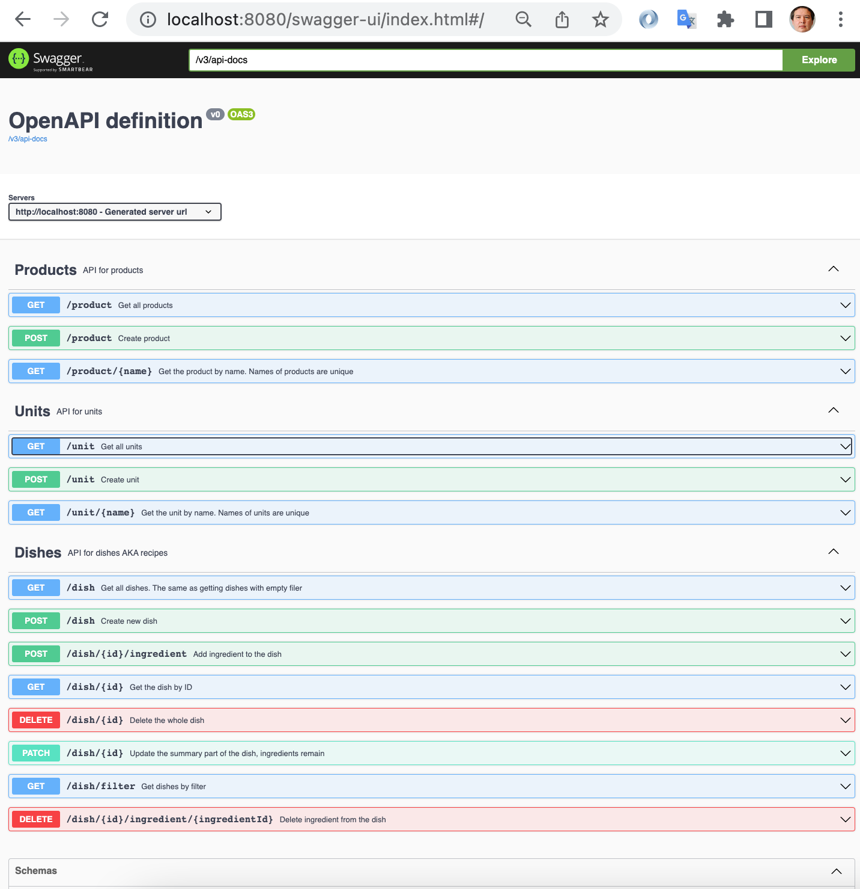

# Cookbook

## Testing and building the project

```
./gradlew test
./gradlew build
```

Build runs tests as well.

## Running the project

```
./gradlew bootRun
```

Also you can start an executable jar.

```
./build/libs/abnamro-assignment-java.jar ../../data
```

## Data preload

There are 3 json files in **data** dir. You can edit them, adding new units, products and dishes.

Or you may delete dishes.json file to skip creation of demo dishes.

Or even delete all of them to keep database clean from start.

If you start executable jar then data dir should be in the same dir as jar or specified as argument.

## Tested Java version: 17

Java records used in the project as DTOs mostly for experiment. Therefore minimum required version is 14 when
records were introduced. Version 17 is current LTS, so it is recommended. 

## Swagger

* [http://localhost:8080/swagger-ui/index.html](http://localhost:8080/swagger-ui/index.html)

## Domain

- **dish** was used instead of *recipe* because dish is more concise and spells more reliable. Dish have several summary fields like *name*, *number sf servings*, *instruction* and list of *ingredients*. Field *vegetarian* calculated by searching of all ingredients products if they all are vegetarian. If at least product is not vegetarian then the whole dish is not as well. 
- **ingredient** holds *amount* of *units* of used *product*, e.g. *0.5* *liter* of *milk*. 
- **product** list considered as a dictionary. Users can choose the product to add it as an ingredient. They also can add new product to the dictionary but cannot delete it. Name of product is case insensitive unique and transformed to lowercase on save. Each *product" has boolean field *vegetarian". Sometimes it's not clearly sure is the product vegetarian or not, it's up to user who adds the product to dictionary.  
- **unit** list als considered as a dictionary. Users can choose the unit of measurement of the product when adding an ingredient. Name of unit is case insensitive unique and transformed to lowercase on save. List of units naturally finite. 

## Notes

- Documentation of API represented by Swagger (OpenAPI) page integrated into application. It is live and exact. Brief description of API methods added.



- Creation of new dish consists of two steps. First of all you create dish with summary fields. Then you can add many ingredients to it or delete existing. Also you may update summary fields of dish. 

## Used framework and libs

* [Spring boot](https://spring.io/projects/spring-boot) used as proved decision.
* [H2](https://www.h2database.com) database with in-memory storage. It can be easily replaced by any RDBMS of choice, e.g. by PostgreSQL. It's just a matter of dependencies and configuration, no line of code will be changed.
* [lombok](https://projectlombok.org/) to avoid boilerplate code like getters, setters, constructors. Note: use lombok for JPA entities with caution.
* [mapstruct](https://mapstruct.org/) to avoid manual conversions from Entity objects to DTO and vice versa.
* [querydsl](http://querydsl.com/) helps dynamically construct filter queries in a type-safe way. IMHO it is the most interesting part of the project.

## Tests

- tests cover all API methods and the whole lifecycle of creation, updating, filtering and deletion of dishes.
